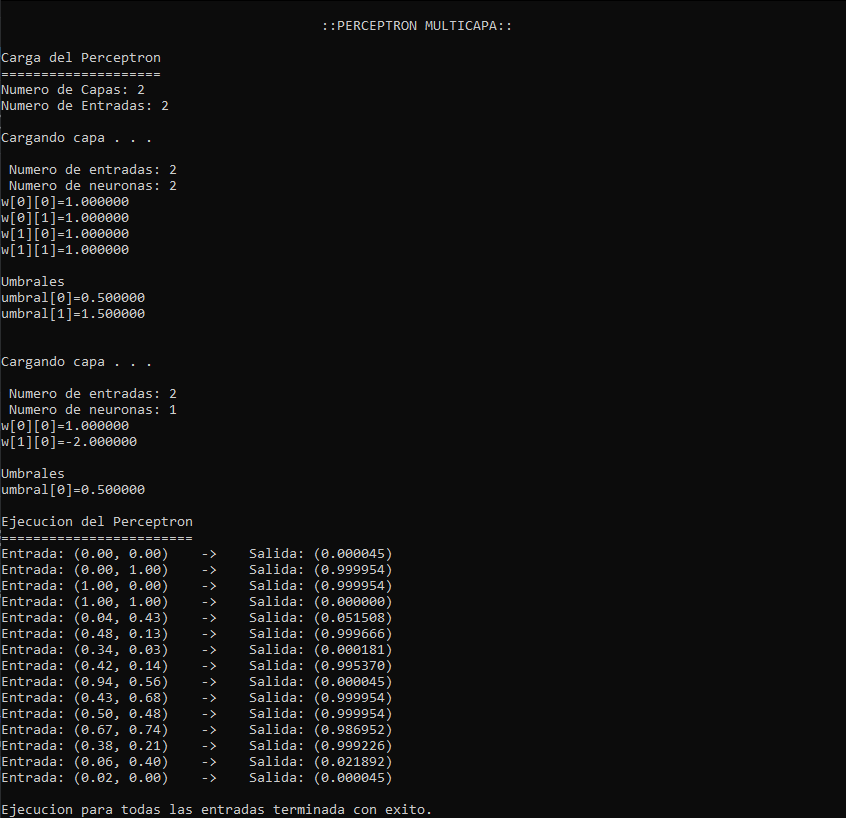

# Multilayer-Perceptron-In-C
This is my solution to a final practice that consisted in developing a Multilayer Perceptron (MLP) capable of performing a forward propagation given a set of inputs from the Programming Fundamentals subject. 

  
  

## Characteristics

- Configuration file for setting number of layers, number of inputs, number of neurons per layer, matrix of weights per layer, and biases per layer.
- Input file, each row in the file specifies an input for execution.
- The activation function used is a slight variation of the sigmoid function with the scaling parameter $\lambda = 20$, the definition is the following: $f(x) = \frac{1}{1+e^{-20x}}$

### Limitations

- Maximum number of layers: 5
- Maximum number of neurons: 5
- Maximum number of inputs: 5

## Compilation and execution

If you want to try to execute it, you need the configuration file of the perceptron 'configuracion', the input file 'entrada' and the main program 'main.c'. You need to execute in the same directory as all these files the following command `gcc "main.c" -o main -lm`, and then to run it just `./main`.

This is an example of a correct execution with the given values in the configuration and input files:

## License
[GPL-3.0](https://www.gnu.org/licenses/gpl-3.0.html)
